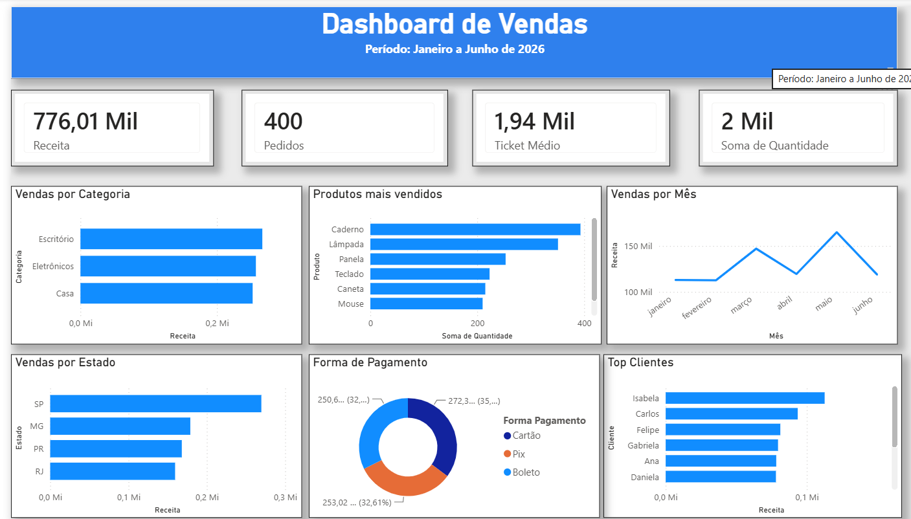

# 📊 Dashboard de Vendas | Power BI

Dashboard interativo desenvolvido para análise de vendas utilizando **Power BI, Excel e DAX**.

## 🎯 Objetivo

Desenvolver um dashboard para acompanhamento de indicadores de vendas e análise de desempenho comercial, permitindo visualizar informações por período, categoria, estado, cliente e forma de pagamento.

## 🛠️ Ferramentas utilizadas

* **Power BI**
* **Excel**
* **DAX**

## 📌 Indicadores (KPIs)

* 💰 Receita Total
* 🛒 Número de Pedidos
* 📈 Ticket Médio
* 📦 Quantidade Vendida

## 🔎 Análises realizadas

* Receita por Categoria
* Produtos Mais Vendidos
* Receita por Estado
* Evolução da Receita por Mês
* Receita por Forma de Pagamento
* Análise dos Top Clientes

## 📂 Arquivos do projeto

* `Dashboard_Vendas_PowerBI.pbix` → Arquivo do dashboard desenvolvido no Power BI
* `base_vendas.xlsx` → Base de dados utilizada para análise

## 📷 Dashboard

## 👩‍💻 Desenvolvido por

**Izabel Santos**

[LinkedIn](seu-link) | [GitHub](seu-link)
